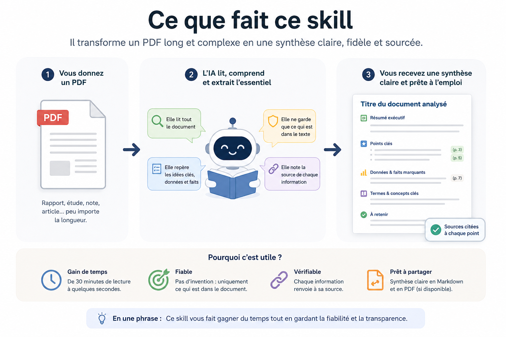

<h1 align="center">📄 → 📝 Synthèse de document PDF</h1>

<p align="center">
  <i>Donnez un PDF à une IA, récupérez une synthèse claire, fiable et sourcée.</i>
</p>

<p align="center">
  
  
  
  
</p>

<p align="center">
  
</p>

---

## 💡 En une phrase

Un document de **30 pages** que personne n'a le temps de lire devient une
**synthèse d'une page** — structurée, fidèle au texte, et qui cite ses sources.

## 🎯 Le problème

On reçoit tous des PDF trop longs : rapports, notes, articles, études.
Les lire prend du temps. Les résumer à la main aussi. Et demander un résumé
« brut » à une IA donne souvent un texte vague, parfois **inventé**, impossible à
vérifier.

## ✅ La solution

Cet outil donne à l'IA une **méthode précise** à suivre. Résultat : une synthèse
toujours présentée de la même façon, et surtout **vérifiable** — chaque
information renvoie à la page d'origine.

| Avant | Après |
|-------|-------|
| 📚 Un PDF de 18 pages | 📝 Une synthèse d'une page |
| ⏱️ 30 min de lecture | ⚡ Quelques secondes |
| ❓ « Est-ce que l'IA a inventé ? » | 🔗 Chaque point cite sa source (p. X) |

## 👀 À quoi ça ressemble

À partir d'un PDF, l'outil produit toujours cette structure :

```markdown
# Pour la France, la contrainte externe n'a pas disparu — A. Cartapanis (2022)

## Résumé exécutif
La contrainte externe n'a pas disparu avec l'euro : le déficit extérieur
français pèse sur la dette et le financement de l'économie...

## Points clés
- L'accumulation de déficits courants expose la France à une crise (p. 3)
- Elle se singularise face aux pays du Nord de la zone euro (p. 3)
- ...

## Données & faits marquants
- Référence à la crise de la zone euro de 2011-2014 (p. 3)
- ...

## Termes & concepts clés
- **Contrainte externe** : limite imposée à un pays par ses échanges avec
  l'étranger (balance des paiements).
- ...

## À retenir
Un risque sous-estimé : la soutenabilité de la dette dépend aussi du reste
du monde.
```

Et si l'ordinateur a **LaTeX** installé, l'outil génère en plus une **version
PDF mise en page**, prête à envoyer.

## ⚙️ Comment ça marche

```
   pdf/                SKILL.md              rapport/
 ┌────────┐         ┌────────────┐        ┌──────────────┐
 │  PDF   │  ───▶   │ l'agent IA │  ───▶  │ synthèse .md │
 │ source │         │ suit la    │        │   + PDF      │
 └────────┘         │ méthode    │        └──────────────┘
                    └────────────┘
```

1. On donne un PDF à l'agent (un chemin, ou un fichier dans le dossier courant).
2. L'agent lit la méthode du skill et rédige.
3. La synthèse apparaît dans `rapport/` (en Markdown, + en PDF si LaTeX est là).

> **Le point important :** le fichier `SKILL.md` n'est pas un programme, c'est une
> **recette** que l'IA lit et applique. L'idée n'est pas de coder, mais de
> *piloter une IA de façon fiable et reproductible* — en lui imposant un format
> et des règles anti-erreur (ne rien inventer, toujours citer la source).

## 🚀 Installation (Codex)

Le skill est conçu pour **Codex** (l'agent d'OpenAI, avec son app Windows / Mac).

1. Récupérer le dossier `synthese-document-pdf/` de ce repo.
2. L'installer avec le skill-installer de Codex :
   ```
   $skill-installer install ./synthese-document-pdf
   ```
3. **Redémarrer Codex** pour qu'il prenne en compte le nouveau skill.

> Le `SKILL.md` suit le format standard des skills (frontmatter `name` /
> `description`) : il est donc aussi compatible avec d'autres agents qui lisent
> ce format.

## ▶️ Utilisation

Une fois installé, depuis n'importe quel dossier de travail :

1. Mettre le PDF à analyser dans le dossier courant (ou indiquer son chemin).
2. Demander à Codex : *« Applique le skill synthese-document-pdf sur ce PDF »*.
3. Récupérer le résultat dans le sous-dossier `rapport/` :
   - une synthèse `.md` (toujours produite),
   - un `.pdf` mis en forme **si LaTeX est installé** sur la machine.

Pour tester sans rien installer, le dossier `exemple/` contient déjà un document
prêt à analyser.

> ℹ️ **Bon à savoir.** Pour les documents dont les *tableaux ou graphiques sont en
> image*, l'outil s'appuie sur un petit utilitaire gratuit (déjà présent sur la
> plupart des Mac et Linux). S'il n'est pas disponible, l'outil fonctionne quand
> même sur le texte — et le signale, plutôt que de passer à côté en silence.

## 🔬 La méthodologie d'analyse

Le cœur du projet n'est pas le code, c'est la **méthode** imposée à l'IA — la même
qu'un analyste suivrait pour produire une note sérieuse. En 5 étapes :

1. **Tout lire, images comprises.** Beaucoup de documents cachent leurs données
   dans des **tableaux et graphiques en image** (rapports, études, scans). L'outil
   extrait ces images et les fait *regarder* à l'IA — pas seulement le texte. Rien
   n'est laissé de côté.
2. **Hiérarchiser l'information.** On sépare l'essentiel (la thèse, l'enjeu) des
   détails, pour qu'un lecteur pressé comprenne en premier ce qui compte.
3. **Tracer chaque affirmation.** Chaque point clé et chaque chiffre renvoie à sa
   **page d'origine** : la synthèse est vérifiable, pas une « boîte noire ».
4. **Expliquer le vocabulaire.** Les termes techniques sont définis simplement,
   pour que la synthèse soit compréhensible par tous.
5. **Distinguer les faits des limites.** On sépare ce que dit le document de ses
   zones d'ombre, et on signale ce qui manque plutôt que de l'inventer.

> Cette démarche — *lire en entier, hiérarchiser, sourcer, vulgariser, nuancer* —
> est exactement ce qu'on attend d'une bonne note de synthèse professionnelle.

## 📁 Contenu du repo

```
.
├── README.md                  ← ce fichier (la vitrine)
├── assets/apercu.png          ← l'infographie
├── synthese-document-pdf/     ← LE SKILL — c'est ce dossier qu'on installe
│   ├── SKILL.md               ←   la méthode que suit l'IA (le cœur du projet)
│   └── extract_images.py      ←   extrait les tableaux/figures en image du PDF
└── exemple/                   ← bac à sable pour tester
    ├── pdf/                   ←   document de démonstration
    └── rapport/               ←   synthèse générée (Markdown + PDF)
```

## 🛡️ Pourquoi c'est fiable

L'outil impose à l'IA quatre règles non négociables :

- **Ne rien inventer** — uniquement ce qui est dans le document.
- **Citer la source** de chaque affirmation (page ou section).
- **Signaler les manques** plutôt que de combler les trous.
- **Rester neutre** — pas d'opinion ajoutée.

---

<p align="center"><sub>Projet réalisé par Gabriel Attwood · Licence MIT</sub></p>
